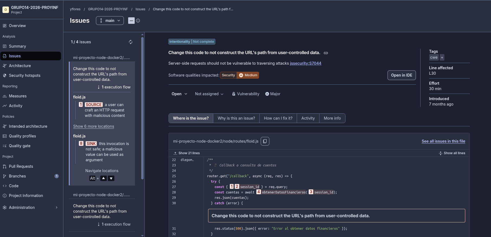
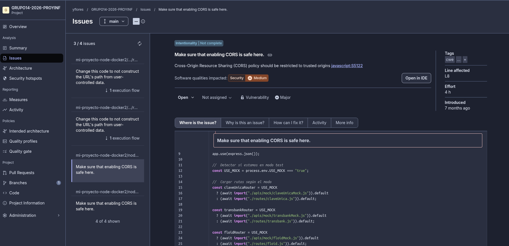
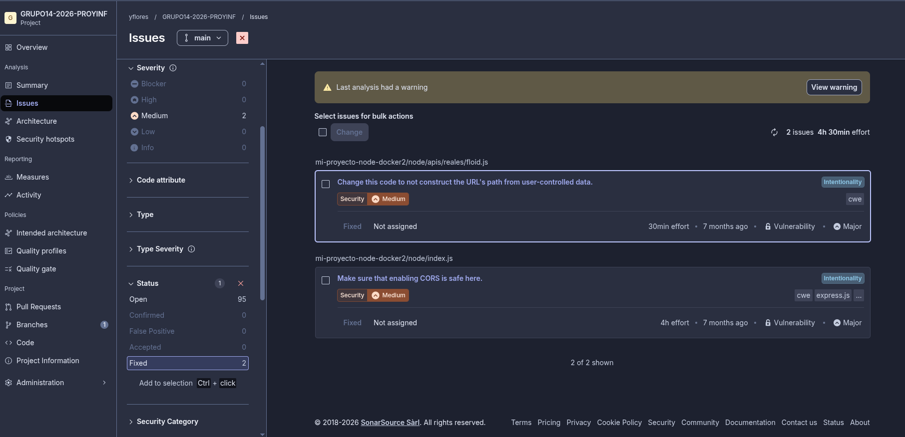

# Inspección de Código - SonarQube

## Resumen
Inspección realizada con SonarQube Cloud sobre el repositorio `GRUPO14-2026-PROYINF`.
Se identificaron 97 issues en total. A continuación se documentan 2 issues de severidad Major seleccionados para corrección.

---

## Issue 1: URL construida desde datos controlados por el usuario

| Campo | Detalle |
|---|---|
| **Archivo** | `node/apis/reales/floid.js` |
| **Línea** | L30 |
| **Tipo** | Vulnerability |
| **Severidad** | Major |
| **Categoría** | Security |

### Descripción
El parámetro `session_id` es obtenido directamente desde `req.query` (dato ingresado por el usuario) y se pasa sin validación a la función `obtenerDatosFinancieros()`, donde se utiliza para construir una URL. Esto expone el sistema a ataques de tipo SSRF (Server-Side Request Forgery).

### Screenshot

### Cómo se abordará
Se validará y sanitizará el parámetro `session_id` antes de usarlo, verificando que cumpla con el formato esperado antes de construir cualquier URL.

### Corrección aplicada
Doble capa de protección:
1. **En `node/routes/floid.js`**: validación temprana del `session_id` desde `req.query` (nulo, vacío o tipo incorrecto → error 400)
2. **En `node/apis/reales/floid.js`**: validación de formato alfanumérico y sanitización con `encodeURIComponent()` antes de insertar en la URL, con throw de error si el formato es inválido

---

## Issue 2: Configuración CORS insegura

| Campo | Detalle |
|---|---|
| **Archivo** | `node/index.js` |
| **Línea** | L8 |
| **Tipo** | Vulnerability |
| **Severidad** | Major |
| **Categoría** | Security |

### Descripción
La política CORS no está restringida a orígenes de confianza, lo que permite que cualquier dominio externo realice peticiones a la API. Esto puede facilitar ataques cross-origin no autorizados.

### Screenshot

### Cómo se abordará
Se configurará CORS especificando explícitamente los orígenes permitidos (dominio del frontend) en lugar de permitir todos los orígenes con `*`.

### Corrección aplicada
En `node/index.js`, se cambió `app.use(cors())` por `app.use(cors({ origin: ["http://localhost:3001", "http://frontend:3000"] }))`, restringiendo las peticiones CORS únicamente a los orígenes del frontend.

---

## Recomendaciones generales de SonarQube

| Recomendación | ¿Se considera? | Justificación |
|---|---|---|
| Corregir vulnerabilidades SSRF en rutas | Sí | Riesgo de seguridad alto |
| Restringir configuración CORS | Sí | Riesgo de seguridad alto |
| Correcciones de mantenibilidad (Code Smells) | No en este hito | Son de severidad baja y no afectan funcionalidad |

---

## Re-inspección

Luego de aplicar las correcciones y ejecutar un nuevo análisis en SonarQube Cloud, se verificó que ambos issues fueron resueltos satisfactoriamente:

| Issue | Archivo | Estado anterior | Estado posterior |
|---|---|---|---|
| URL desde datos del usuario | `node/apis/reales/floid.js:30` | Open (Major) | **Resuelto** |
| CORS inseguro | `node/index.js:8` | Open (Major) | **Resuelto** |

El total de issues del proyecto se redujo de **97 a 95**, confirmando la eliminación de ambos issues.

### Screenshots de re-inspección

